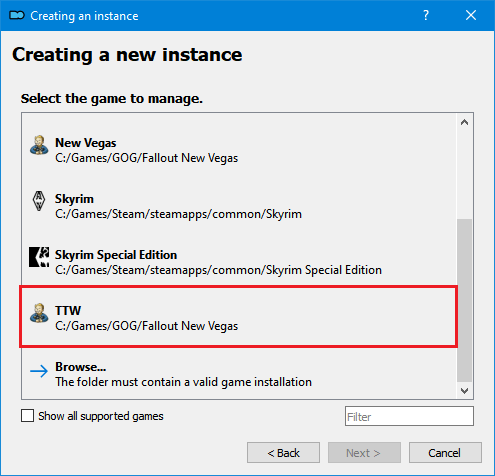

# Mod Organizer 2
In this step, we will install and configure Mod Organizer 2, the best mod manager for any Bethesda game and the only one supported for the guide.

## Installing MO2
Download [Main File - Mod Organizer 2](https://www.nexusmods.com/skyrimspecialedition/mods/6194?tab=files) using the **Manual Download** link.
Run the downloaded installer and choose an unoccupied, non-UAC folder such as `C:\Modding\Mod Organizer 2`. 
**Do not** install MO2 into the [Root](./setup/#important-locations) game folder.

## Initial Setup
Run **ModOrganizer.exe**, click **Next** to the **Creating an instance** pop-up, then select **Create a global instance**:


Select **TTW** from the list of games, then click *Next*. If TTW is 
not in the list, you very likely forgot to run Fallout 3 once through Steam/GOG during
the [Generating Fresh .INI Files](setup#generating-fresh-ini-files) step.

 

Leave the *Location* file path default and click *Finish*.  Say *No* to the *Show Guide?*
pop-up, then say *Yes* to the *Register* pop-up (if you receive one). If at any point you 
get a *INI file is read-only* pop-up, select *Remember my choice* from the drop-down at 
the bottom, then click *Clear the read-only flag*. 

If there is a plugin called `FalloutNV_lang.esp` in the **right pane** of Mod Organizer 2, navigate
to the game's [Data folder](setup#important-locations) and delete it. This plugin conflicts with
(i.e. breaks) most mods by making thousands of direct record edits to the game in order to translate
the language.

## Configuring Settings

Click the  button at the top of MO2 to open the settings.
On the **General** tab, enable **Compact list** and *disable* **Show menubar when pressing Alt**. 
Choose a **Theme** on the next tab. Our favourites are *Dracula*, *vs15 Dark* & *1809 Dark Mode*.
*Fusion* works best for Linux users. Finally, click **Connect to Nexus** on the **Nexus** tab.


This option will not show up if you have already connected your Nexus account on a different MO2 instance.
MO2 will open your browser and prompt you to authorize the connection; afterwards you can close your browser
and the MO2 settings menu. Allow MO2 to restart if it asks. 

Select the 
button at the top of MO2 to open the profiles menu. Ensure both **Use profile-specific Game INI Files** and 
**Automatic Archive Invalidation** are enabled on the default profile.


## FalloutCustom.ini

Click the  button at the top of MO2 and select **INI Editor**.
Make sure you are in the **FalloutCustom.ini** tab and NOT the **Custom.ini** tab. It should be blank right now.
Paste in the following:
```ini
[Audio]
; Enables additional worker thread for minor performance improvement. Disable if you encounter audio stutter
bMultiThreadAudio=1
; Disables debug logging to save memory and CPU time
bUseAudioDebugInformation=0
; Increases memory buffers to reduce audio issues
iAudioCacheSize=8192
iMaxSizeForCachedSound=1024

[BackgroundLoad]
; Forces cell unload on fast travel to lessen memory usage
bSelectivePurgeUnusedOnFastTravel=1

[Controls]
; Disables mouse acceleration
fForegroundMouseAccelBase=0
fForegroundMouseAccelTop=0
fForegroundMouseBase=0
fForegroundMouseMult=0

[Display]
; Enables Fullscreen mode (space in setting is NOT a typo)
bFull Screen=1
; Forces highest texture quality so the game will not crash if you had it set to anything lower
iTexMipMapSkip=0

[General]
; Forces faster cell unload to lessen memory usage
bPreemptivelyUnloadCells=1
; Spawns additional AI worker threads
bUseThreadedAI=1
; Enables multithreading for most operations
iNumHWThreads=2
; Sets TTW's starting quest
SCharGenQuest=001FFFF8
; Disables FNV intro movie
SIntroMovie=

[Grass]
; Increases grass draw distance
fGrassStartFadeDistance=11200

[Loading]
; Increases time interval between background slides
fMainMenuBkgdUpdateInterval=60.0000

[Menu]
; Changes console font
iConsoleFont=3

[PipBoy]
; Fixes flicker when opening Pip-Boy when its light is on
fLightEffectFadeDuration=400

[SpeedTree]
; Forces max draw distance for bushes
bForceFullLOD=1

[TerrainManager]
; Increases LOD draw distance
fBlockLoadDistance=300000.0000
fBlockLoadDistanceLow=125000.0000
```


## How to Install Mods
##### A [video](https://www.youtube.com/watch?v=7v0wWVuOagA) is available to assist with this part of the guide.

To minimize repetition, the install instructions for a typical mod in the guide are very concise:

> Main File - Example Mod 1.5

This refers to the mod's Nexus **category**, **file name**, and **file version**. 
Unless instructed otherwise, simply click the listed file's **Mod Manager Download** button. The mod will appear in the **Downloads** tab of MO2's right pane; double-click it to install. If you need a visual reference, the first 60 seconds of the video above should help; the remainder is mostly about Skyrim and won't be relevant.

If at any point during mod installation you get a message called **Extract BSA**, select **No**.

### Manual & Off-Nexus Downloads
If a mod has no **Mod Manager Download** button, or is hosted on a site other than Nexus, click the
**Manual Download** (or equivalent) button & save the archive somewhere. Drag the downloaded archive into MO2's 
**Downloads** pane and finish as usual. Another option is to press Ctrl+M to open the "Install
from Archive" interface, then navigate to wherever you saved the archive.

### Merge, Replace, or Rename?
When you install multiple mods from the same Nexus page, MO2 will ask if you want to **Merge**, 
**Replace**, or **Rename**. Always **Rename** to the respective **file name** so that MO2 
installs each file separately. The only time you should ever use **Replace** instead of Rename is 
if you are updating a mod, as this will delete all the files from the old version of the mod and 
replace them with the ones from the new version. **Merge** should be avoided unless explicitly
instructed to use it by a mod author.